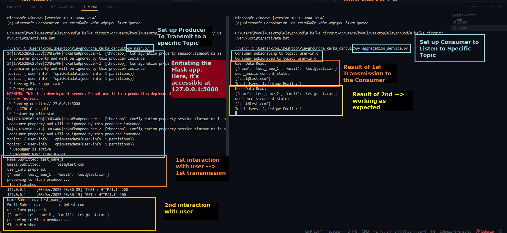

# What is it

This is a working example of utilizing a Kafka instance.

This instance is hosted from Confluent Cloud, but exactly the same can be replicated locally in every environment, since Kafka is open source.

The only things that would change are the information inside the `client.properties` file.

Overall, it includes:
* In the main.py:
A flask app that contains *a producer* who's *posting* the *data submitted from the user* of the flask app *to a topic* hosted on the Kafka instance.
Before that, there's a topic creation procedure that checks whether a certain topic exists and creates it. This process is not a best practice.
This topic name is defined in the .env file.

* The *aggregation_service.py* contains a primitive "application" run with a `while True` statement (which is ridiculous in a production setting).
This service contains *a consumer* of the same topic and it's actually a counter. It stores in its own memory the distinct e-mails submitted, but it could be doing other actions as well (for example, instead of storing in-memory, it could be communicating with a database which provides more permanent and stable storage).
The point is it's tuned / synced on the same topic and is making actions on every change.

# How to Replicate
1. Create a virtual environment:

```py -m venv .venv```

2. Activate it (if not done automatically by VSCode) by calling one of the `activate` scripts contained inside the .venv/Scripts folder (which one specifically, depends on your os and/or prompt you're using)

3. Install dependencies:
```pip install -r requirements.txt```

4. Run both services:


